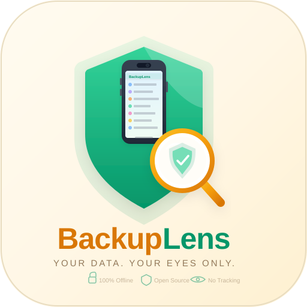

<p align="center">
  
</p>

<h1 align="center">BackupLens</h1>

<p align="center">
  <strong>Your data. Your eyes only.</strong><br>
  A free, open-source GUI tool to decrypt, browse, and extract files from encrypted iPhone and iPad backups.
</p>

<p align="center">
  <a href="#-installation"></a>
  <a href="LICENSE"></a>
  <a href="#-security--privacy"></a>
  <a href="#-security--privacy"></a>
  
</p>

---

## Why BackupLens?

You made an encrypted iPhone backup with iTunes, Finder, or the Apple Devices app. Now you need to get your photos, messages, or health data out of it. You search online and find tools that:

- Cost $30–$80 for a license
- Upload your data to unknown servers
- Are closed source — you have no idea what they do with your passwords
- Haven't been updated since 2019

**BackupLens is different.**

| | BackupLens | Paid alternatives |
|---|---|---|
| **Price** | Free forever | $30–$80 |
| **Open source** | Yes — read every line | No |
| **Network access** | None. Zero. Offline only. | Often phones home |
| **Your password** | Never stored, never sent | Who knows? |
| **Platform** | Windows, macOS, Linux | Usually one platform |

---

## Features

- **Decrypt encrypted backups** — Supports iOS 13+ encrypted local backups
- **Browse by category** — Camera Roll, Messages, Health, Apps, and more
- **Search across all files** — Find exactly what you need instantly
- **Extract individual files or bulk export** — Save to any folder
- **Auto-detects backups** — Finds your backup folder automatically
- **Cross-platform** — Works on Windows, macOS, and Linux
- **Single file** — The entire app is one Python file you can audit in one sitting

---

## Installation

### Prerequisites

- **Python 3.8 or newer** — [Download Python](https://www.python.org/downloads/)
- **tkinter** — Included with Python on Windows and macOS. On Linux: `sudo apt install python3-tk`

### Quick Start

```bash
# 1. Clone the repository
git clone https://github.com/mrgunes/BackupLens.git
cd BackupLens

# 2. Install dependencies (just one!)
pip install -r requirements.txt

# 3. Run BackupLens
python backuplens.py
```

That's it. No build step, no Docker, no config files.

---

## Usage

### 1. Find your backup

BackupLens auto-detects your backup location. If it doesn't, here's where iTunes/Finder stores them:

| Platform | Default backup location |
|---|---|
| **Windows** | `%APPDATA%\Apple Computer\MobileSync\Backup\` |
| **macOS** | `~/Library/Application Support/MobileSync/Backup/` |
| **Linux** | Backups must be copied from a Windows/Mac machine |

### 2. Enter your password

This is the **encryption password you set in iTunes, Finder, or the Apple Devices app**, NOT your Apple ID password.

**Forgot your password?**
- **macOS:** Open Keychain Access, search for `iOS Backup` — the password is stored there
- **Windows:** Check if you saved it in your password manager

### 3. Browse and extract

- Click categories on the left to filter files
- Use the search bar to find specific files
- Select files and click **Extract Selected**, or export everything with **Extract All in View**

---

## Security & Privacy

> **iPhone backups contain your most sensitive data — photos, messages, health records, passwords, financial apps, and more. You should be extremely careful about which tools you trust with this data.**

### Our security promises:

1. **100% Offline** — BackupLens makes zero network connections. Disconnect your internet and it works identically. [Verify it yourself.](SECURITY.md)

2. **Your password is never stored** — It's held in memory only while the app runs. When you close BackupLens, it's gone.

3. **No telemetry, no analytics, no tracking** — We don't know you exist. We don't want to.

4. **Fully auditable** — The entire app is a single Python file (~600 lines). Read it. We encourage it.

5. **Open source dependencies** — Our only dependency ([iphone_backup_decrypt](https://github.com/jsharkey13/iphone_backup_decrypt)) is also open source and MIT licensed.

For our full security policy, see [SECURITY.md](SECURITY.md).

---

## Where are my backups?

### Windows

1. Press `Win + R`, type `%APPDATA%\Apple Computer\MobileSync\Backup`, press Enter
2. Each subfolder (long alphanumeric name) is one device backup

### macOS

1. Open Finder, press `Cmd + Shift + G`
2. Paste: `~/Library/Application Support/MobileSync/Backup/`
3. Each subfolder is one device backup

### How to create an encrypted backup

1. Connect your iPhone/iPad to your computer
2. Open **iTunes** (Windows) or **Finder** (macOS)
3. Select your device
4. Check **"Encrypt local backup"**
5. Set a password — **remember this password!**
6. Click **Back Up Now**

---

## FAQ

<details>
<summary><strong>Is this safe to use?</strong></summary>

Yes. BackupLens is 100% offline, open source, and makes no network connections. Your password never leaves your machine. You can verify all of this by reading the source code — it's a single file.
</details>

<details>
<summary><strong>Can BackupLens crack/bypass my backup password?</strong></summary>

No. BackupLens requires your correct encryption password to decrypt the backup. It cannot guess, crack, or bypass passwords. This is a feature, not a limitation — it means no one else can access your data without the password either.
</details>

<details>
<summary><strong>Does this work with iCloud backups?</strong></summary>

No. BackupLens only works with **local encrypted backups** created by iTunes, Finder, or the Apple Devices app. iCloud backups are stored on Apple's servers and cannot be accessed by this tool.
</details>

<details>
<summary><strong>What iOS versions are supported?</strong></summary>

BackupLens supports encrypted backups from **iOS 13 and newer** (including iOS 17, 18). This covers iPhone 6s and later.
</details>

<details>
<summary><strong>I forgot my backup password. Can BackupLens help?</strong></summary>

BackupLens cannot recover forgotten passwords. However:
- **macOS users:** Check Keychain Access (search for "iOS Backup")
- **All users:** Try common passwords you may have used, or check your password manager
- As a last resort, you can [reset your backup password](https://support.apple.com/en-us/102566) by resetting all settings on your iPhone (this won't delete your data, but you'll need to create a new backup)
</details>

<details>
<summary><strong>Some files show warnings during extraction. Is that normal?</strong></summary>

Yes. Some files (especially app databases) may show size mismatch warnings. This is normal and usually means the file was being written to when the backup was created. The extracted data is still usable in most cases.
</details>

<details>
<summary><strong>Can I use this on Linux?</strong></summary>

Yes! Install `python3-tk` (`sudo apt install python3-tk` on Ubuntu/Debian) and follow the normal installation steps. You'll need to copy your backup folder from a Windows or Mac machine first.
</details>

---

## Contributing

Contributions are welcome! Whether it's bug fixes, new features, or documentation improvements.

1. Fork the repository
2. Create a feature branch: `git checkout -b feature/amazing-feature`
3. Commit your changes: `git commit -m 'Add amazing feature'`
4. Push to the branch: `git push origin feature/amazing-feature`
5. Open a Pull Request

Please keep in mind:
- **Security is paramount.** Any PR that adds network access will be rejected.
- **Keep it simple.** The app should remain a single file that anyone can audit.
- **Test on multiple platforms** if possible.

---

## Verify It Yourself

Don't trust us? Good. Here's how to confirm BackupLens makes zero network connections:

```bash
# Option 1: Disconnect from the internet and run the app — it works identically.

# Option 2: Monitor network activity (macOS)
sudo lsof -i -P | grep python

# Option 3: Monitor network activity (Windows PowerShell)
Get-NetTCPConnection | Where-Object { $_.OwningProcess -eq (Get-Process python).Id }

# Option 4: Read the source — it's one file, ~600 lines.
```

---

## Acknowledgements

BackupLens is built on top of the excellent [iphone_backup_decrypt](https://github.com/jsharkey13/iphone_backup_decrypt) library by James Sharkey. Thank you for making encrypted backup decryption accessible to everyone.

---

## License

[MIT](LICENSE) — Use it, modify it, share it. Free forever.

---

<p align="center">
  <strong>Built with care by <a href="https://github.com/mrgunes">Eyyup (Eric) Gunes</a></strong><br>
  <sub>Because your data should be yours — no subscriptions, no surveillance, no strings attached.</sub><br><br>
  <strong>Did BackupLens save your data?</strong> Give it a <a href="https://github.com/mrgunes/BackupLens">star</a> so others can find it too.<br>
  <a href="https://github.com/mrgunes">Follow @mrgunes</a> for more privacy-first tools.
</p>
